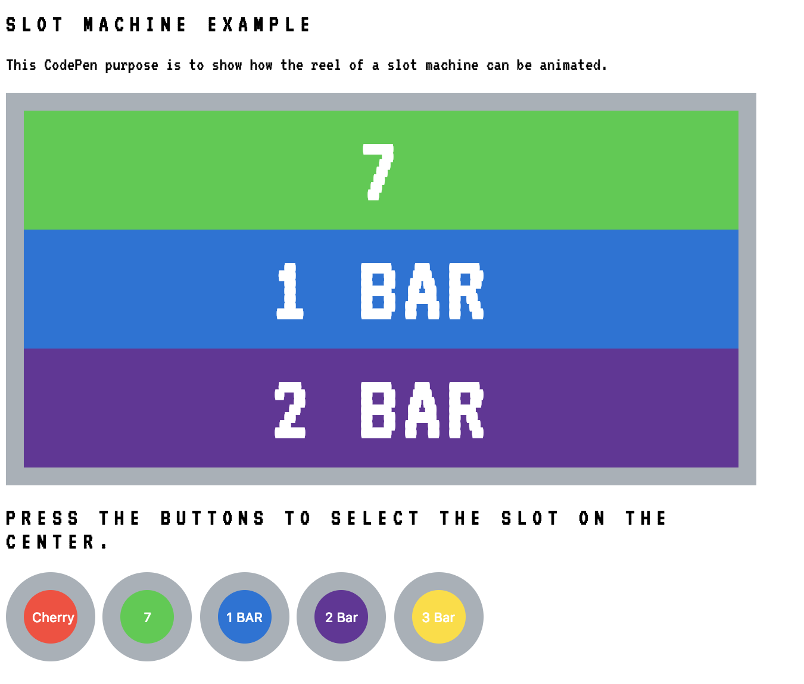
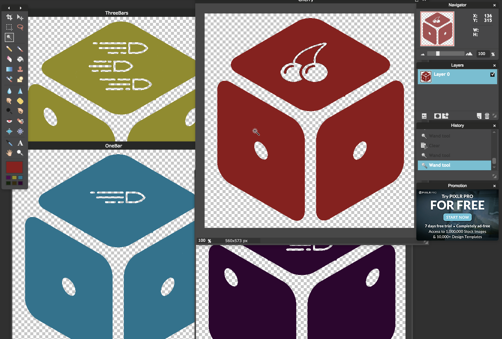

# Slot Machine

[]()


### Installation


Install the dependencies and run the project.

```sh
$ npm install 
$ npm start
```


### Commentaries:

REELS

The reels is where the magic happens. To create the spinning animation firstly I developed a small example to see how the reel of a slot machine can be animated. 

[](https://codepen.io/and951/pen/XxNdem?editors=1001)

Design

To give a personal touch to the project I design the following dice icons base on  Bohdan Burmich Lucky Icon [Bohdan Burmich Dice Icon](https://thenounproject.com/icon/224119/)

[]()


### Todos


License
----

MIT


[//]: # (These are reference links used in the body of this note and get stripped out when the markdown processor does its job. There is no need to format nicely because it shouldn't be seen. Thanks SO - http://stackoverflow.com/questions/4823468/store-comments-in-markdown-syntax)


   [git-repo-url]: <https://github.com/joemccann/dillinger.git>
   [markdown-it]: <https://github.com/markdown-it/markdown-it>
   [node.js]: <http://nodejs.org>

----------
By Andrés Jiménez, 2018.
